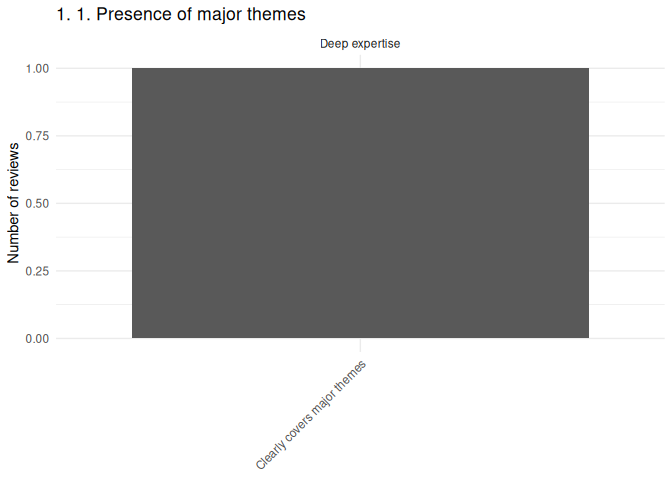
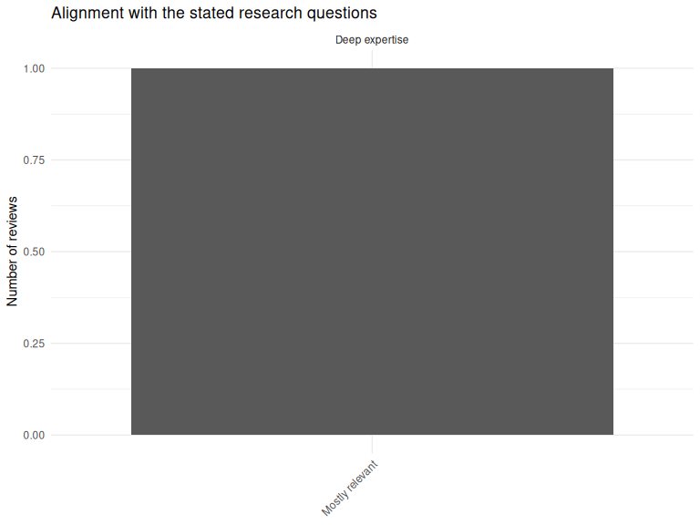
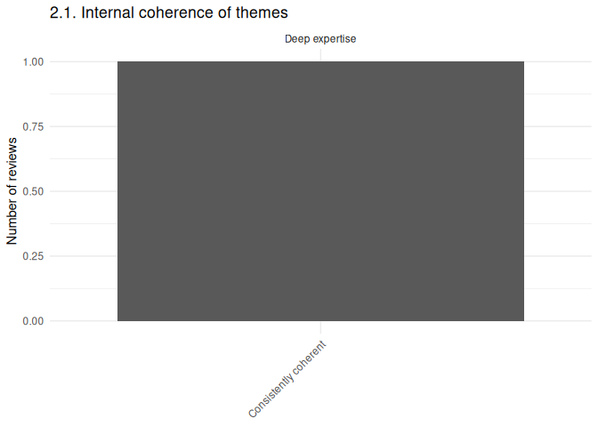
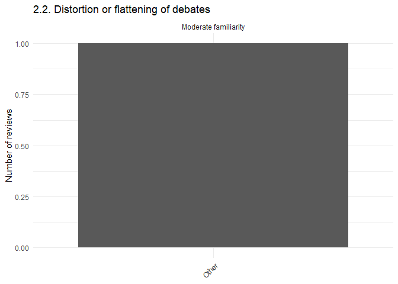
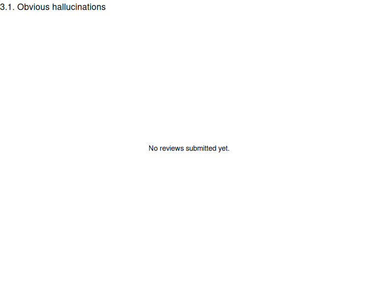
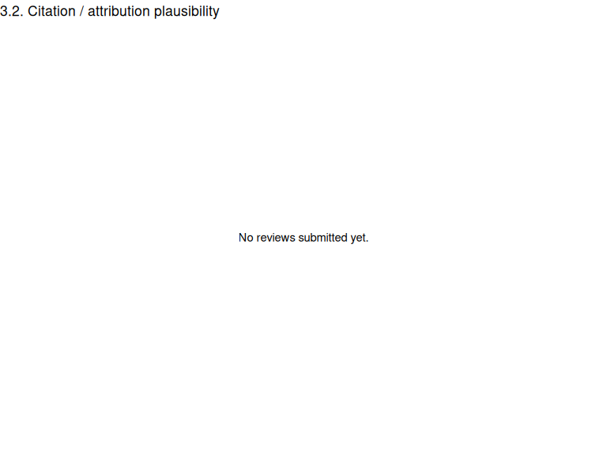
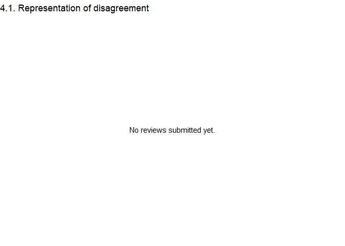
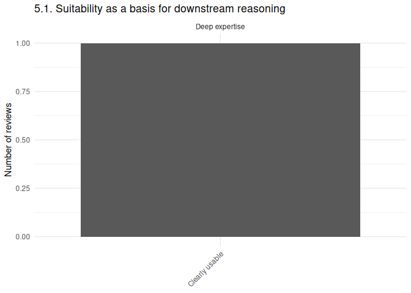
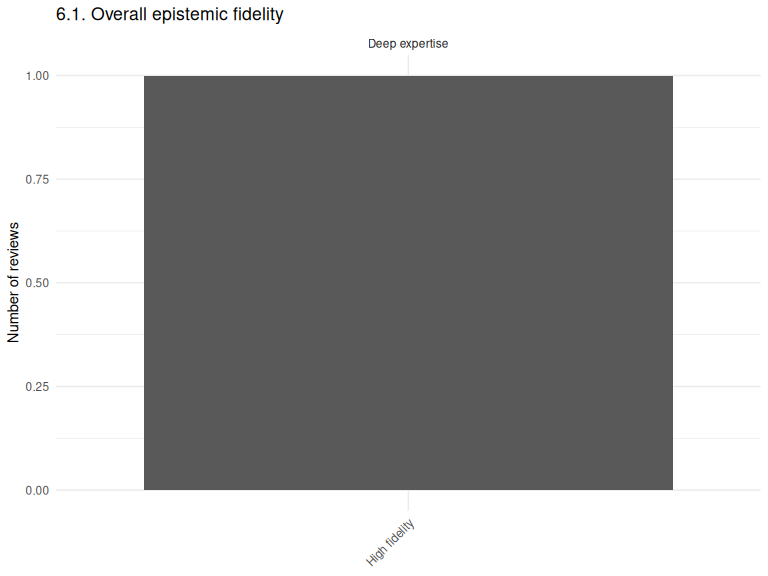

ReadingMachine Public Evaluation
================
James Morrissey
2026-06-11

# ReadingMachine Evaluation Archive

## About this evaluation

This archive contains public reviews of the ReadingMachine industrial
policy corpus synthesis.

The [purpose of the
evaluation](https://github.com/morrisseyj/ReadingMachine/blob/main/evaluation/EVAL_INSTRUCTIONS.md)
is to assess whether ReadingMachine achieves its stated design goals,
including coverage of major themes, alignment with research questions,
thematic coherence, preservation of disagreement, avoidance of
hallucination, citation plausibility, downstream usefulness, and overall
epistemic fidelity.

Reviews are published openly. Personal contact information is never
released. Reviewers may choose whether their comments are attributed by
name, affiliation, or anonymously.

This evaluation process is experimental and intended to contribute to
the development of a more formal benchmark for structured corpus
reading.

# Evaluation Summary

1 reviews have been submitted.

## Reviewer Familiarity

| Familiarity with the literature |   n |
|:--------------------------------|----:|
| Deep expertise                  |   1 |

## Reviewer Roles

| Role       |   n |
|:-----------|----:|
| Researcher |   1 |

## Reviewer Affiliations

| Affiliation |   n |
|:------------|----:|
| Oxfam       |   1 |

# Detailed Evaluation

## 1. Presence of Major Themes

<!-- -->

### Reviewer Comments on Missing Themes (only populated if missing themes identified)

| Reviewer | Familiarity | Rating | Comment |
|:---------|:------------|:-------|:--------|

------------------------------------------------------------------------

## 2. Alignment with Research Questions

<!-- -->

### Reviewer Comments on Alignment Issues (only populated if alignment issues identified)

| Reviewer                           | Familiarity    | Rating          | Comment   |
|:-----------------------------------|:---------------|:----------------|:----------|
| James Morrissey, Oxfam, Researcher | Deep expertise | Mostly relevant | ipso test |

------------------------------------------------------------------------

## 3. Internal Coherence of Themes

<!-- -->

### Reviewer Comments on Theme Coherence (only populated if issues with theme coherence identified)

| Reviewer | Familiarity | Rating | Comment |
|:---------|:------------|:-------|:--------|

------------------------------------------------------------------------

## 4. Distortion or Flattening of Debates

<!-- -->

### Reviewer Comments on Distorted Debates (only populated if distortions were identified)

| Reviewer | Familiarity | Rating | Comment |
|:---|:---|:---|:---|
| James Morrissey, Oxfam, Researcher | Deep expertise | Widespread distortion | complete mess |

------------------------------------------------------------------------

## 5. Hallucinations

<!-- -->

### Reviewer Reports of Hallucinations (only populated if hallucinations were identified)

| Reviewer | Familiarity | Rating | Comment |
|:---------|:------------|:-------|:--------|

------------------------------------------------------------------------

## 6. Citation / Attribution Plausibility

<!-- -->

### Reviewer Comments on Citation Issues (only populated if citation issues were identified)

| Reviewer | Familiarity | Rating | Comment |
|:---------|:------------|:-------|:--------|

------------------------------------------------------------------------

## 7. Representation of Disagreement

<!-- -->

### Reviewer Comments on Disagreement Preservation (only populated if failure to presrve disagreement was identified)

| Reviewer | Familiarity | Rating | Comment |
|:---------|:------------|:-------|:--------|

------------------------------------------------------------------------

## 8. Suitability for Downstream Reasoning

<!-- -->

### Reviewer Comments on Downstream Use (only populated if limitations on downstream usefulness was identified)

| Reviewer | Familiarity | Rating | Comment |
|:---------|:------------|:-------|:--------|

------------------------------------------------------------------------

## 9. Overall Epistemic Fidelity

<!-- -->

### Reviewer Comments on Epistemic Fidelity (only populated if issues with epistemic fidelity were identified)

| Reviewer | Familiarity | Rating | Comment |
|:---------|:------------|:-------|:--------|

------------------------------------------------------------------------

# Additional Comments

| Reviewer                           | Comment    |
|:-----------------------------------|:-----------|
| James Morrissey, Oxfam, Researcher | Great work |

# Data Access

The anonymized evaluation dataset used to generate this report is
available in this repository.

All quantitative ratings and qualitative comments are preserved to
support transparency, independent inspection, and future benchmark
development.
